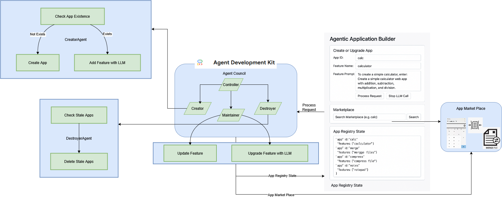

# moonlight
javascript deep dive study till 2030
# Design 2025

## Project "Moonlight" : Crafting Dynamic Web Apps with AI Agents
**A Practical Guide to Building Self-Evolving Applications with LLMs**

---
**Index**

* AppRegistry: Chapter 1
* LLMAgent: Chapter 2
* CreatorAgent: Chapter 3
* MaintainerAgent: Chapter 4
* DestroyerAgent: Chapter 5
* CouncilController: Chapter 6
* User Interface: Chapter 7

---
Unlock the power of AI to build web applications that practically manage themselves!

"Moonlight " takes you on a fascinating journey into the world of autonomous software agents. This book provides a hands-on guide to building a system inspired by "moonlight," a research project centered around creating web applications using vanilla JavaScript without any external dependencies. This unique approach emphasizes clean, efficient code and provides a solid foundation for leveraging AI in dynamic web development.

Discover how to design and implement a system where intelligent agents collaborate to bring your web development ideas to life. From the core Application Registry that stores your creations to the CouncilController that orchestrates the entire process, you'll gain practical insights into:

* **Building a robust Application Registry:** Learn how to efficiently store and manage your growing collection of web apps.
* **Harnessing the power of LLM Agents:** Master the art of communicating with OpenAI's API to generate innovative features and upgrades.
* **Creating autonomous agents for every stage:** Explore the roles of the CreatorAgent, MaintainerAgent, and even the DestroyerAgent in the application lifecycle.
* **Orchestrating with the CouncilController:** Understand how to coordinate these agents to achieve seamless and dynamic application evolution.
* **Designing intuitive User Interfaces:** Build simple yet effective interfaces to interact with your intelligent system.

Whether you're a seasoned developer or an enthusiastic newcomer, "Moonlight " will illuminate the path to a new era of web development, where AI empowers you to build smarter, more dynamic applications, drawing inspiration from the principles of clean, dependency-free JavaScript championed by the "moonlight" project.

---

**Table of Contents:**

**Moonlight : Crafting Dynamic Web Apps with AI Agents**

**Table of Contents**

**Overview: Illuminating the "Moonlight" Project**
* Introducing the concept of vibe coding and autonomous agents.
* High-level architecture of the system, inspired by the "moonlight" research on vanilla JavaScript.
* Benefits and potential applications of this approach.

**Chapter 1: Application Registry: The Heart of Your Creations**
* Understanding the role of the Application Registry.
* Deep dive into the `this.apps` object for storing app records.
* Implementing `getApp`, `saveApp`, and `deleteApp` for efficient app management.
* Code examples and practical considerations within the context of vanilla JavaScript principles.

**Chapter 2: LLM Agent: The Intelligent Feature Generator**
* Exploring the communication with the OpenAI API.
* Crafting effective prompts for feature generation and upgrades.
* Implementing the `Workspace` request for API interaction.
* Handling API responses and potential errors, keeping in mind the goal of generating vanilla JavaScript code.

**Chapter 3: CreatorAgent: Bringing New Apps to Life**
* The process of initializing new applications in the registry with `createApp`.
* Leveraging LLM support to generate initial feature code with `addFeatureWithLLM`, aiming for vanilla JavaScript implementation.
* Strategies for guiding the LLM during the creation process to adhere to "moonlight" principles.

**Chapter 4: MaintainerAgent: Evolving and Enhancing Existing Apps**
* Implementing `updateFeature` for merging additional data into existing features.
* Requesting LLM-based upgrades and improvements with `updateFeatureWithLLM`, focusing on maintaining the vanilla JavaScript nature.
* Techniques for providing context to the LLM for effective maintenance within the "moonlight" framework.

**Chapter 5: DestroyerAgent: Keeping the Registry Clean**
* Understanding the importance of removing stale applications.
* Implementing the `checkAndDestroyStaleApps` function.
* Strategies for defining "staleness" based on timestamps or other criteria.

**Chapter 6: CouncilController: The Orchestrator of Intelligence**
* Coordinating the actions of all agents within the system.
* Passing relevant prompts to the CreatorAgent and MaintainerAgent.
* Periodically invoking the DestroyerAgent for automated cleanup.
* Implementing logic for decision-making and task delegation.

**Chapter 7: UI Interaction: Your Window to the "Moonlight" System**
* Designing a simple and intuitive user interface using vanilla JavaScript principles.
* Implementing the "Process Request" functionality for creating or updating apps.
* Adding the "Stop LLM Call" feature to manage long-running requests.
* Implementing the "Search" functionality for filtering apps in the marketplace.
* Displaying the application registry and features in a `<pre>` block for clear visibility.

